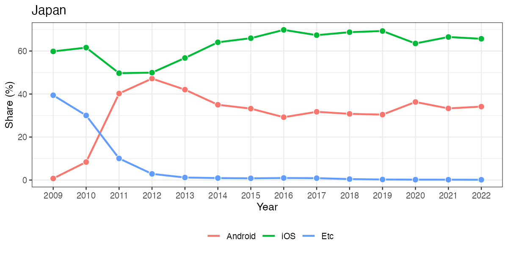
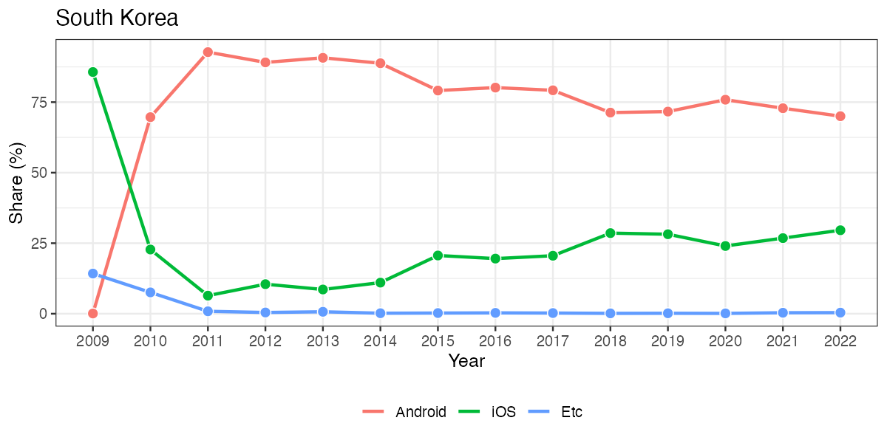

# Mobile OS Share (2009-2022)

## Information

* Creator: Jaehyun Song
* Last updated: 2022/11/08
* Source: <https://gs.statcounter.com>

## Sample

```r
library(tidyverse)
os_df <- read_csv("mobile_os_share.csv")

os_df
```

```
# A tibble: 3,486 × 33
      ID Country Code   Date Android   iOS Symbi…¹ Serie…² Unknown Nokia…³ Samsung Windows
   <int> <chr>   <chr> <dbl>   <dbl> <dbl>   <dbl>   <dbl>   <dbl>   <dbl>   <dbl>   <dbl>
 1     1 Afghan… AF     2009    0.19  4.59   84.0     0       9.88    0       0.08    0.29
 2     2 Afghan… AF     2010    2.44 13.4    70.0     0       5.56    0       3.01    0.21
 3     3 Afghan… AF     2011    4.98 16.6    62.4     0       5.92    0       3.6     0.51
 4     4 Afghan… AF     2012   12.8  15.4    44.2    14.3     4.71    0       3.5     0.78
 5     5 Afghan… AF     2013   27.4  14.5    23.9    23.2     4.19    0.13    3.06    0.76
 6     6 Afghan… AF     2014   50.6  15.6    11.4    15.3     1.96    0.88    1.62    1.09
 7     7 Afghan… AF     2015   71.5  12.8     4.74    4.92    1.57    2.58    0.43    0.72
 8     8 Afghan… AF     2016   78.7  11.4     2.57    1.87    1.77    2.46    0.31    0.44
 9     9 Afghan… AF     2017   83.5  10.7     1.24    0.88    2.05    1.13    0.09    0.27
10    10 Afghan… AF     2018   93.8   4.8     0.37    0.17    0.48    0.17    0.07    0.11
# … with 3,476 more rows, 21 more variables: `Sony Ericsson` <dbl>, Linux <dbl>,
#   `BlackBerry OS` <dbl>, bada <dbl>, MeeGo <dbl>, LG <dbl>, `Maemo 5` <dbl>,
#   Other <dbl>, `Nintendo 3DS` <dbl>, Sailfish <dbl>, Playstation <dbl>, Nintendo <dbl>,
#   KaiOS <dbl>, Tizen <dbl>, Motorola <dbl>, `Firefox OS` <dbl>, webOS <dbl>,
#   LiMo <dbl>, JAVA <dbl>, WAP <dbl>, Brew <dbl>, and abbreviated variable names
#   ¹​SymbianOS, ²​`Series 40`, ³​`Nokia Unknown`
# ℹ Use `print(n = ...)` to see more rows, and `colnames()` to see all variable names
```

```r
os_df %>%
  mutate(Etc = 100 - Android - iOS) %>%
  select(ID:iOS, Etc) %>%
  filter(Code == "JP") %>%
  pivot_longer(cols      = Android:Etc,
               names_to  = "OS",
               values_to = "Share") %>%
  mutate(OS = fct_inorder(OS)) %>%
  ggplot(aes(x = Date, y = Share)) +
  geom_line(aes(color = OS), size = 1) +
  geom_point(aes(fill = OS), shape = 21, size = 3, color = "white") +
  guides(fill = "none") +
  labs(x = "Year", y = "Share (%)", color = "", title = "Japan") +
  scale_x_continuous(breaks = 2009:2022, labels = 2009:2022) +
  theme_bw(base_size = 12) +
  theme(legend.position    = "bottom",
        panel.grid.minor.x = element_blank())
```



```r
os_df %>%
  mutate(Etc = 100 - Android - iOS) %>%
  select(ID:iOS, Etc) %>%
  filter(Code == "KR") %>%
  pivot_longer(cols      = Android:Etc,
               names_to  = "OS",
               values_to = "Share") %>%
  mutate(OS = fct_inorder(OS)) %>%
  ggplot(aes(x = Date, y = Share)) +
  geom_line(aes(color = OS), size = 1) +
  geom_point(aes(fill = OS), shape = 21, size = 3, color = "white") +
  guides(fill = "none") +
  labs(x = "Year", y = "Share (%)", color = "", title = "South Korea") +
  scale_x_continuous(breaks = 2009:2022, labels = 2009:2022) +
  theme_bw(base_size = 12) +
  theme(legend.position    = "bottom",
        panel.grid.minor.x = element_blank())
```



## Further Update

* 国別の変数を追加（大陸、人口、面積、政治経済指標等）
